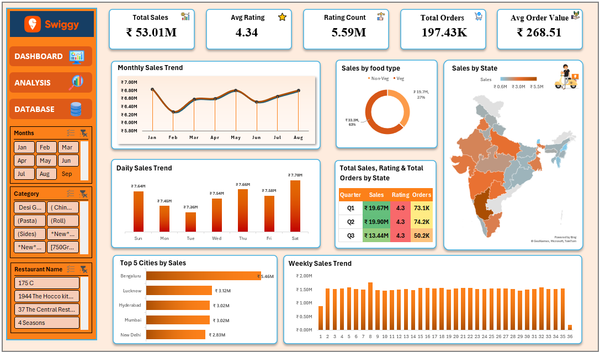

# 🍽️ Swiggy Sales Dashboard (Excel Project)

## 📌 Project Overview
This project is an **interactive Swiggy Sales Dashboard** created using **Microsoft Excel**.  
The dashboard provides a complete business-level overview of food orders, revenue, customer satisfaction, and performance trends using KPIs and visual analytics.

The main goal of this project is to analyze Swiggy’s sales data and convert raw data into **meaningful business insights** for better decision-making.

---

## 🎯 Problem Statement  
**Business Requirement Development (BRD)**  

To build a dashboard that helps stakeholders:
- Track overall revenue and order performance  
- Measure customer satisfaction  
- Identify sales trends over time  
- Analyze performance by food type, location, and time period  

---

## 📊 Key Performance Indicators (KPIs)

1. **Total Sales** – Overall revenue generated from food orders  
2. **Average Rating** – Customer satisfaction level across all restaurants  
3. **Average Order Value (AOV)** – Revenue generated per order  
4. **Rating Count** – Total number of customer reviews  
5. **Total Orders** – Total number of food orders received  

---

## 📈 Charts & Visualizations (BRD)

1. Monthly Sales Trend  
2. Daily Sales Trend  
3. Total Sales by Food Type (Veg vs Non-Veg)  
4. Total Sales by State (Map Visualization)  
5. Quarterly Performance Summary  
6. Top 5 Cities by Sales  
7. Weekly Trend Analysis  

---

## 🖼️ Dashboard Preview

### 📌 Swiggy Sales Dashboard
> Below is the snapshot of the Excel dashboard created for this project:

> 📌 **Note:**  
> - Replace `dashboard.png` with your actual image file name  
> - Make sure the image is uploaded in the same GitHub repository  
> - If the image is inside a folder (e.g. `images`), use:
>   ``

---

## 🛠️ Tools & Techniques Used
- Microsoft Excel  
- Pivot Tables & Pivot Charts  
- Data Cleaning & Transformation  
- KPI Cards  
- Conditional Formatting  
- Map Visualization  
- Dashboard Design & Layout  

---

## 📂 Dataset Information
- Swiggy food order dataset (cleaned & processed)
- Includes:
  - Orders  
  - Revenue  
  - Ratings  
  - City & State  
  - Food Type (Veg / Non-Veg)  
  - Date & Time  

---

## 📌 Key Insights
- Identified top-performing cities and states  
- Found peak sales periods weekly, monthly, and quarterly  
- Compared Veg vs Non-Veg revenue contribution  
- Analyzed customer satisfaction using ratings  

---

## 🚀 Conclusion
This Excel dashboard provides a **clear, interactive, and data-driven view of Swiggy’s business performance** and supports better business decision-making.

---

## 👤 Author
**Your Name**  
📊 Aspiring Data Analyst  
🛠️ Skills: Excel | Data Analysis | Dashboarding
